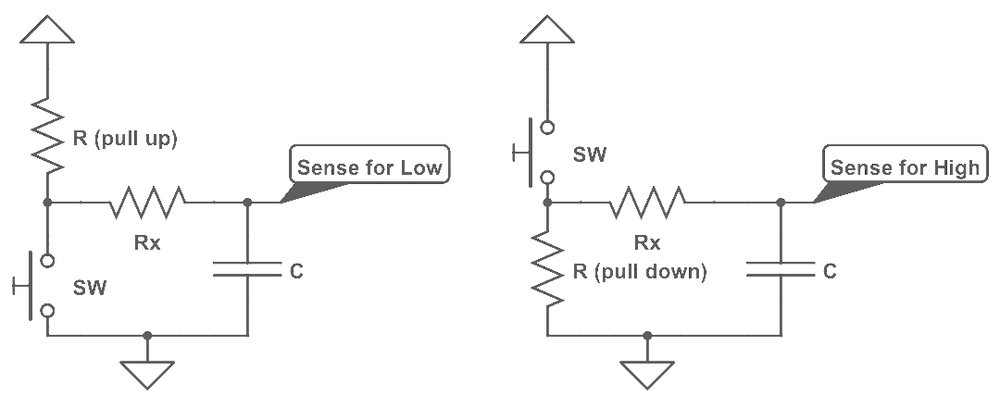
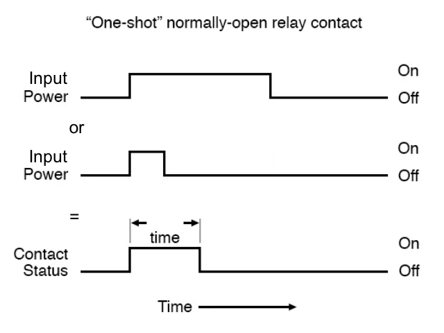
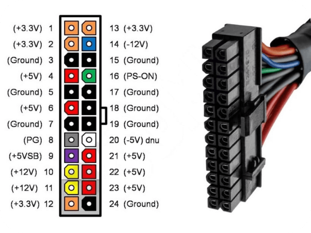
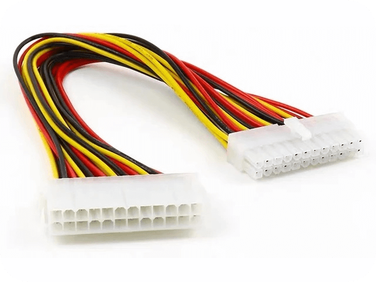
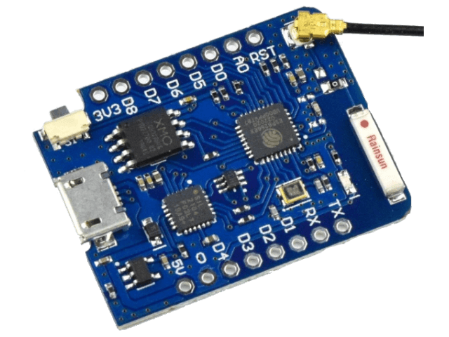
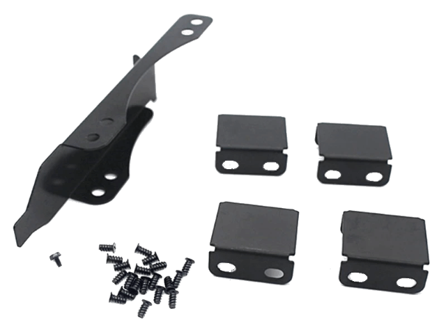
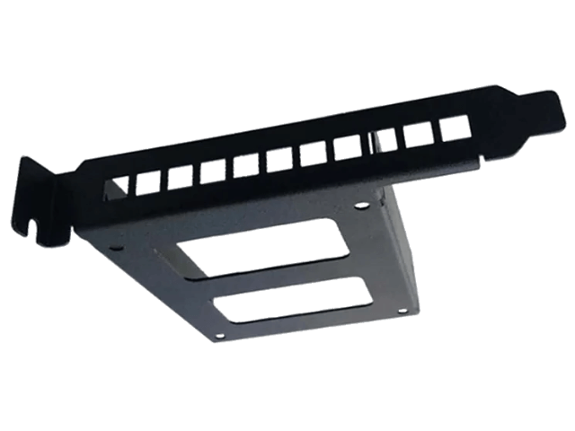

#  Home Assistant PC Switch

**Control your PC from Home Assistant using [ESPHome](https://github.com/esphome/esphome) or [Tasmota](https://github.com/arendst/Tasmota), and integrated into [Home Assistant](https://www.home-assistant.io/).**

---

**`STATUS`**: This project is in ideation stage.  Come back soon for progress.

**`LAST UPDATE`**: 4 May 2024 `// May the force be with you`

---

> *"A good scientist is a person with original ideas. A good engineer is a person who makes a design that works with as few original ideas as possible. There are no prima donnas in engineering."* -- Freeman Dyson

## Origins

Looking for a way to remotely start-up and shut-down a PC from Home Assistant.  Also need operational status (sensors) to drive automations.

## Ideas

### Other People's Projects

* Zvonko Bockaj *@Hackster* - [WEMOS ESP8266 Remote PC Switch](https://www.hackster.io/zvonko-bockaj/wemos-esp8266-remote-pc-switch-062c7a) `// this one makes most sense`
* `ajfriesen` - [The pc-switch](https://www.ajfriesen.com/pc-switch/) `// great source for ESPHome YAML example`
* `Erriez` *@Github* - [ESPHomePCPowerControlHomeAssistant](https://github.com/Erriez/ESPHomePCPowerControlHomeAssistant/) `// ditto`

&

* `SilverFire` *@Github* - [esp8266-pc-power-control](https://github.com/SilverFire/esp8266-pc-power-control/)
* Lerk - [Turning a PC on and off using an ESP8266](https://lerks.blog/p/turning-a-pc-on-and-off-using-an-esp)

## Specifications (as a wish list)

### Inputs

1. Power Standby (from PSU pin 9 {purple} / +5V SB (Standby)) - *as source of operating +5V power*
2. Power Good (from PSU, pin 8 {gray} / PG (Pwr Good))
3. Power Supply ON (from PSU, pins 21,22 {red} )
4. PC ON (from Case LED)
5. Case / MLB POWER Button
6. Case / MLB Reset Button

* GND (2x sources from PSU & MLB)

### Sensors (exposed to HA)

* Power Good (from PSU, pin 8 {gray, *measure `true` when +5V*})
* Power (Supply) ON (from PSU, pin 16 {green, *measure `false` when +5V* } / PS-ON (Pwr Sply switch))
    * *This is the pin that need to be grounded for the PSU to switch on, so needs careful testing to make sure one does not have false ON states.*
* (PC) Power ON (from MLB, case LED) {*measure `true` when +5V*}
* Optional: via D1 Mini hats
    * Case temperature

### Outputs
* Power "relay" *(See note about "relay"'s in ideas below)*
* Reset "relay"
* Case LED (as passthrough)
* Optional: via D1 Mini hats
    * Contact Relay *(e.g. power to RGB LED's?)*

##### Terms used above
* **PSU** = Power Supply (Unit)  
* **MLB** = Mail (Logic) Board / PC Motherboard 

## Ideas

* "Sensor" should be isolated from circuit with an ~~[Op-amp Comparator](https://www.electronics-tutorials.ws/opamp/op-amp-comparator.html) or~~ [Level Shifter](https://www.sparkfun.com/products/12009) circuit.  *(Inputs will be 5V, whilst the ESPxx works on 3.3v.)*

* "Relay" should be an [Optocoupler](https://www.electronics-tutorials.ws/blog/optocoupler.html)
    * ~~Do **<u>not</u>** use a transistor, nor a mechanical relay~~
    * [**`UPDATE`**: Some PC's have "Positive" switches, others have "Negative" switches.  Accounting for this is too complex *(i.e. prone to installer error)*, so would it be better to use a * relay* *(e.g. Omron G6K [SMD @ &#xB1;$7], or Songle `SRD-3VDC-SL-C` / Omrom G5LE [THD @ &#xB1;$0.36&#xA2;] )*.]

        The issue here is that the MLB *(PC Motherboard)* may be using a low-sensing circuit, or a high-sensing circuit - and this PCB must account for both!

         

        All we get access to is the points that are the pins of the switch.

* &#x26A0; "Relay" should be driven by a "Delay OFF type" circuit, and 2 timings must be provided
    * 300ms delay from ON back to OFF to simulate a "press".
    * 5.5s delay on ON, then back to OFF to simulate a "long press".

         

    3 possible ways to do this:

    1. EE solution with caps and transistors - *not really viable since because of its variable performance and unchangeable nature. (See [here](https://www.homemade-circuits.com/simple-delay-timer-circuits-explained/))*

    2. If Software solution (i.e. on ESPHome or Tasmota), then how do we create a **"One-Shot" Normally-Open** switch?

        * ESPHome, can do this with with a [`on_turn_on` trigger](https://esphome.io/components/switch/gpio.html#momentary-switch).
        
        * Tasmota, can do this with "*Rules*" on the device.

        * Home Assistant with an automation trigger using an "`action`" > "`sequence`".

        But, what if the user forgets to "modify" the default f/w or build the HA automation required?  The device ***<u>must</u>*** handle the one-shot functionally itself.

        &#x26A0; Custom f/w (or fork of) must be built for timed "one-shot" / "delay off" functionality.

    3. Usa a second MCU with a timing circuit - e.g. ATtiny85 or **STM8S001J3**

        * May be useful as a feedback "sensor".
        * Don't forget to provide programming headers.

* Tap into the PSU ATX Cable for power and PSU inputs
    * Std ATX  
        
    * Use a ATX power extender to "tap" into correct cables  
        

* Use the WEMOS D1 Mini form-factor and pin-outs, but prototype on:
    * [WEMOS D1 Mini Pro](https://www.aliexpress.com/item/1005006109635545.html) (with external antenna)  
      
    * [LOLIN ESP32 S2 Mini](https://www.aliexpress.com/item/1005006157693055.html)  
      

* Build the PCB in a way that the unit can attach to a **PCI Slot Bracket Cover**, specifically build for:
    * PCI Slot Fan Mount Rack for video card for 90mm and 120mm fans  
      
    * PCI Slot for 2.5inch hard drive, rear panel mount  
      

    Will allow for drilling holes for external antenna.

---

Made with &#x1F499; by .
